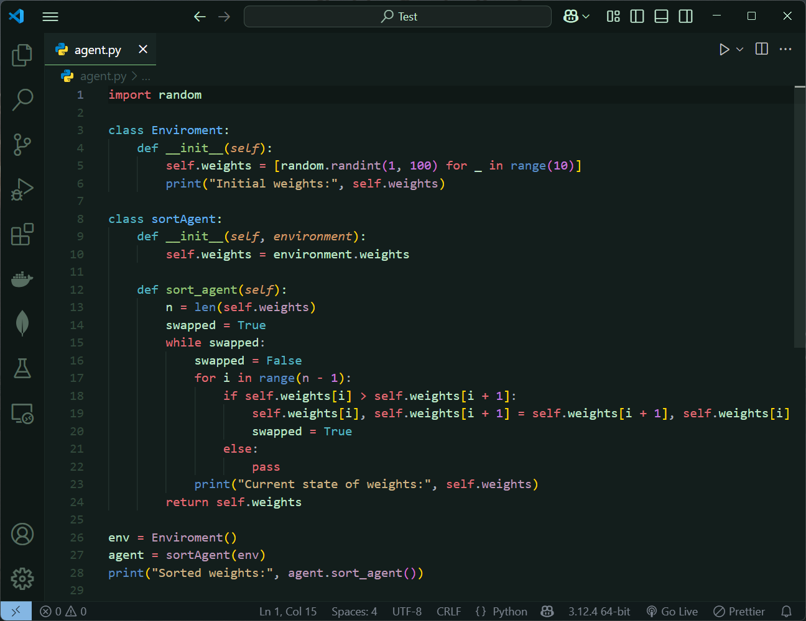

# Aurorain Theme
A dark theme for VS Code.

  

## Installation

1. Open VS Code
2. Go to Extensions (`Ctrl + Shift + X`)
3. Search for "Aurorain"
4. Click "Install"
 
 Enjoy coding with style!

  

